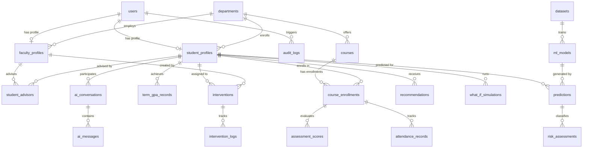

# Student Success Predictor — Database Architecture & Schema Design
**Document Version:** 1.0.0  
**Phase:** 0 (Architecture & Planning)  
**Status:** Approved Schema Baseline  

---

## 1. Database Overview & Strategy

The application utilizes **PostgreSQL 16** as its primary relational database.  
All database interactions are managed via **SQLAlchemy 2.0 ORM** and version-controlled using **Alembic** migration scripts.

### Key Architectural Tenets:
1. **Relational Integrity:** Strong foreign key constraints with explicit `ON DELETE` rules (`RESTRICT`, `CASCADE`, `SET NULL`) prevent orphan records.
2. **Auditability & Traceability:** All core business tables inherit `created_at` and `updated_at` timestamps. Every ML prediction links to an exact `model_version_id`.
3. **Strict Data Ownership:** Records are keyed to `student_id` or `faculty_id`, enforcing unambiguous row-level authorization boundaries in application queries.
4. **Separation of Real vs. Simulated Data:** Counterfactual "What-If" runs are quarantined in `what_if_simulations` and never touch production `academic_records`.
5. **Optimized Indexing:** B-tree indexes are placed on foreign keys, lookups, composite search vectors (`student_id`, `term`), and status filter columns.

---

## 2. Entity-Relationship Diagram (ERD)

---

## 3. Detailed Entity Definitions & Schemas

### 3.1 Authentication & User Management

#### `users`
Represents application accounts for authentication and role authorization.
* **Table Name:** `users`
* **Purpose:** Core identity store for all system actors.

| Column Name | Data Type | Nullable | Constraints / Default | Description |
| :--- | :--- | :--- | :--- | :--- |
| `id` | `UUID` | No | `PRIMARY KEY, DEFAULT gen_random_uuid()` | Unique user identifier |
| `email` | `VARCHAR(255)` | No | `UNIQUE, INDEX` | Institutional login email |
| `hashed_password` | `VARCHAR(255)` | No | | Argon2id/Bcrypt hash |
| `full_name` | `VARCHAR(150)` | No | | User display name |
| `role` | `VARCHAR(20)` | No | `CHECK (role IN ('ADMIN', 'FACULTY', 'STUDENT'))` | RBAC role |
| `is_active` | `BOOLEAN` | No | `DEFAULT TRUE` | Account active flag |
| `is_verified` | `BOOLEAN` | No | `DEFAULT FALSE` | Email verification flag |
| `created_at` | `TIMESTAMPTZ` | No | `DEFAULT CURRENT_TIMESTAMP` | Account creation timestamp |
| `updated_at` | `TIMESTAMPTZ` | No | `DEFAULT CURRENT_TIMESTAMP` | Last profile update |

---

### 3.2 Institutional Structure & Profiles

#### `departments`
* **Purpose:** Academic department classification (e.g., Computer Science, Electrical Engineering).

| Column Name | Data Type | Nullable | Constraints / Default | Description |
| :--- | :--- | :--- | :--- | :--- |
| `id` | `UUID` | No | `PRIMARY KEY, DEFAULT gen_random_uuid()` | Department ID |
| `code` | `VARCHAR(20)` | No | `UNIQUE` | Department code (e.g., "CS", "ECE") |
| `name` | `VARCHAR(100)` | No | | Department name |
| `created_at` | `TIMESTAMPTZ` | No | `DEFAULT CURRENT_TIMESTAMP` | Creation timestamp |

#### `student_profiles`
* **Purpose:** Extended academic identity for users with role `STUDENT`.

| Column Name | Data Type | Nullable | Constraints / Default | Description |
| :--- | :--- | :--- | :--- | :--- |
| `id` | `UUID` | No | `PRIMARY KEY, DEFAULT gen_random_uuid()` | Profile ID |
| `user_id` | `UUID` | No | `UNIQUE, FK -> users(id) ON DELETE CASCADE` | Associated user |
| `student_number` | `VARCHAR(50)` | No | `UNIQUE, INDEX` | Institutional Roll / ID Number |
| `department_id` | `UUID` | No | `FK -> departments(id) ON DELETE RESTRICT` | Student department |
| `enrollment_year` | `INTEGER` | No | `CHECK (enrollment_year >= 2000)` | Year of matriculation |
| `current_semester`| `INTEGER` | No | `CHECK (current_semester BETWEEN 1 AND 12)` | Current term index |
| `cumulative_gpa`  | `NUMERIC(4, 2)`| Yes | `CHECK (cumulative_gpa BETWEEN 0.00 AND 10.00)`| Official institutional CGPA |
| `total_credits_earned`| `INTEGER` | No | `DEFAULT 0` | Completed credits |
| `created_at` | `TIMESTAMPTZ` | No | `DEFAULT CURRENT_TIMESTAMP` | Record creation |
| `updated_at` | `TIMESTAMPTZ` | No | `DEFAULT CURRENT_TIMESTAMP` | Record update |

#### `faculty_profiles`
* **Purpose:** Academic staff identity for users with role `FACULTY`.

| Column Name | Data Type | Nullable | Constraints / Default | Description |
| :--- | :--- | :--- | :--- | :--- |
| `id` | `UUID` | No | `PRIMARY KEY, DEFAULT gen_random_uuid()` | Profile ID |
| `user_id` | `UUID` | No | `UNIQUE, FK -> users(id) ON DELETE CASCADE` | Associated user |
| `employee_number` | `VARCHAR(50)` | No | `UNIQUE, INDEX` | Staff employee ID |
| `department_id` | `UUID` | No | `FK -> departments(id) ON DELETE RESTRICT` | Department affiliation |
| `designation` | `VARCHAR(100)` | Yes | | Title (e.g., Professor, Advisor) |
| `created_at` | `TIMESTAMPTZ` | No | `DEFAULT CURRENT_TIMESTAMP` | Record creation |

#### `student_advisors`
* **Purpose:** Explicit mapping between faculty advisors and assigned student cohorts.

| Column Name | Data Type | Nullable | Constraints / Default | Description |
| :--- | :--- | :--- | :--- | :--- |
| `id` | `UUID` | No | `PRIMARY KEY, DEFAULT gen_random_uuid()` | Mapping ID |
| `faculty_id` | `UUID` | No | `FK -> faculty_profiles(id) ON DELETE CASCADE` | Advisor ID |
| `student_id` | `UUID` | No | `FK -> student_profiles(id) ON DELETE CASCADE` | Advised student |
| `assigned_at` | `TIMESTAMPTZ` | No | `DEFAULT CURRENT_TIMESTAMP` | Assignment timestamp |
| | | | `UNIQUE(faculty_id, student_id)` | Composite unique constraint |

---

### 3.3 Academic Records & Coursework

#### `courses`
* **Purpose:** Subject catalog.

| Column Name | Data Type | Nullable | Constraints / Default | Description |
| :--- | :--- | :--- | :--- | :--- |
| `id` | `UUID` | No | `PRIMARY KEY, DEFAULT gen_random_uuid()` | Course ID |
| `department_id` | `UUID` | No | `FK -> departments(id) ON DELETE RESTRICT` | Department offering course |
| `course_code` | `VARCHAR(20)` | No | `UNIQUE, INDEX` | Course identifier (e.g., "CS201") |
| `course_name` | `VARCHAR(150)` | No | | Full title (e.g., "Data Structures") |
| `credits` | `INTEGER` | No | `CHECK (credits > 0)` | Course credit weight |
| `created_at` | `TIMESTAMPTZ` | No | `DEFAULT CURRENT_TIMESTAMP` | Creation timestamp |

#### `course_enrollments`
* **Purpose:** Specific term enrollment linking a student to a course section.

| Column Name | Data Type | Nullable | Constraints / Default | Description |
| :--- | :--- | :--- | :--- | :--- |
| `id` | `UUID` | No | `PRIMARY KEY, DEFAULT gen_random_uuid()` | Enrollment ID |
| `student_id` | `UUID` | No | `FK -> student_profiles(id) ON DELETE CASCADE` | Student ID |
| `course_id` | `UUID` | No | `FK -> courses(id) ON DELETE RESTRICT` | Enrolled course |
| `academic_year` | `VARCHAR(10)` | No | (e.g., "2025-2026") | Academic calendar year |
| `semester` | `INTEGER` | No | `CHECK (semester BETWEEN 1 AND 12)` | Semester of enrollment |
| `final_grade` | `VARCHAR(5)` | Yes | | Recorded letter grade (e.g., "A", "B", "F") |
| `final_score` | `NUMERIC(5, 2)`| Yes | `CHECK (final_score BETWEEN 0.00 AND 100.00)` | Final numerical score |
| `is_completed` | `BOOLEAN` | No | `DEFAULT FALSE` | Completion status |
| | | | `UNIQUE(student_id, course_id, academic_year, semester)` | Unique enrollment |

#### `attendance_records`
* **Purpose:** Granular/aggregate attendance metrics utilized in ML feature vectors.

| Column Name | Data Type | Nullable | Constraints / Default | Description |
| :--- | :--- | :--- | :--- | :--- |
| `id` | `UUID` | No | `PRIMARY KEY, DEFAULT gen_random_uuid()` | Record ID |
| `enrollment_id` | `UUID` | No | `FK -> course_enrollments(id) ON DELETE CASCADE` | Associated enrollment |
| `total_sessions` | `INTEGER` | No | `CHECK (total_sessions >= 0)` | Conducted classes |
| `attended_sessions`| `INTEGER` | No | `CHECK (attended_sessions >= 0)` | Classes attended |
| `attendance_percentage` | `NUMERIC(5, 2)` | No | `CHECK (attendance_percentage BETWEEN 0.00 AND 100.00)` | Attended / Total * 100 |
| `recorded_date` | `DATE` | No | `DEFAULT CURRENT_DATE` | Date of calculation |

#### `assessment_scores`
* **Purpose:** Continuous assessment entries (quizzes, midterms, lab evaluations, assignments).

| Column Name | Data Type | Nullable | Constraints / Default | Description |
| :--- | :--- | :--- | :--- | :--- |
| `id` | `UUID` | No | `PRIMARY KEY, DEFAULT gen_random_uuid()` | Assessment ID |
| `enrollment_id` | `UUID` | No | `FK -> course_enrollments(id) ON DELETE CASCADE` | Associated enrollment |
| `assessment_name` | `VARCHAR(100)` | No | | Assessment title (e.g., "Midterm Exam") |
| `assessment_type` | `VARCHAR(50)` | No | `CHECK (assessment_type IN ('MIDTERM', 'QUIZ', 'ASSIGNMENT', 'PROJECT', 'LAB'))` | Type |
| `maximum_marks` | `NUMERIC(5, 2)` | No | `CHECK (maximum_marks > 0)` | Total possible marks |
| `obtained_marks` | `NUMERIC(5, 2)` | No | `CHECK (obtained_marks >= 0)` | Student score |
| `weightage_percentage` | `NUMERIC(4, 2)` | Yes | | Weight in final grade |
| `created_at` | `TIMESTAMPTZ` | No | `DEFAULT CURRENT_TIMESTAMP` | Record timestamp |

#### `term_gpa_records`
* **Purpose:** Longitudinal semester performance history.

| Column Name | Data Type | Nullable | Constraints / Default | Description |
| :--- | :--- | :--- | :--- | :--- |
| `id` | `UUID` | No | `PRIMARY KEY, DEFAULT gen_random_uuid()` | Record ID |
| `student_id` | `UUID` | No | `FK -> student_profiles(id) ON DELETE CASCADE` | Student ID |
| `academic_year` | `VARCHAR(10)` | No | | (e.g., "2024-2025") |
| `semester` | `INTEGER` | No | `CHECK (semester BETWEEN 1 AND 12)` | Semester index |
| `sgpa` | `NUMERIC(4, 2)` | No | `CHECK (sgpa BETWEEN 0.00 AND 10.00)` | Semester GPA |
| `credits_registered` | `INTEGER` | No | | Registered credits |
| `backlog_count` | `INTEGER` | No | `DEFAULT 0, CHECK (backlog_count >= 0)` | Failed subjects pending |
| `created_at` | `TIMESTAMPTZ` | No | `DEFAULT CURRENT_TIMESTAMP` | Timestamp |
| | | | `UNIQUE(student_id, academic_year, semester)` | Unique term entry |

---

### 3.4 ML Models & Prediction History

#### `datasets`
* **Purpose:** Version-controlled training/testing dataset metadata.

| Column Name | Data Type | Nullable | Constraints / Default | Description |
| :--- | :--- | :--- | :--- | :--- |
| `id` | `UUID` | No | `PRIMARY KEY, DEFAULT gen_random_uuid()` | Dataset ID |
| `name` | `VARCHAR(150)` | No | | Dataset name |
| `version` | `VARCHAR(50)` | No | `UNIQUE` | Semantic version (e.g., "v1.2.0") |
| `record_count` | `INTEGER` | No | | Total sample count |
| `features_schema` | `JSONB` | No | | JSON schema of training features |
| `file_path` | `VARCHAR(500)` | No | | Storage path of raw/processed file |
| `checksum_sha256` | `VARCHAR(64)` | No | | Cryptographic integrity hash |
| `created_by` | `UUID` | Yes | `FK -> users(id) ON DELETE SET NULL` | Admin uploader |
| `created_at` | `TIMESTAMPTZ` | No | `DEFAULT CURRENT_TIMESTAMP` | Upload timestamp |

#### `ml_models`
* **Purpose:** Registry of trained, serialized prediction pipelines.

| Column Name | Data Type | Nullable | Constraints / Default | Description |
| :--- | :--- | :--- | :--- | :--- |
| `id` | `UUID` | No | `PRIMARY KEY, DEFAULT gen_random_uuid()` | Model ID |
| `model_name` | `VARCHAR(100)` | No | | Name (e.g., "academic_risk_xgb") |
| `version` | `VARCHAR(50)` | No | `UNIQUE` | Model version (e.g., "1.0.0") |
| `dataset_id` | `UUID` | No | `FK -> datasets(id) ON DELETE RESTRICT` | Associated dataset |
| `model_type` | `VARCHAR(50)` | No | `CHECK (model_type IN ('CLASSIFIER', 'REGRESSOR', 'ENSEMBLE'))` | Type |
| `algorithm` | `VARCHAR(100)` | No | | Algorithm (e.g., "XGBoost 2.0") |
| `hyperparameters` | `JSONB` | No | | Trained hyperparameters |
| `evaluation_metrics`| `JSONB` | No | | Test accuracy, F1, ROC-AUC, RMSE |
| `artifact_path` | `VARCHAR(500)` | No | | Storage path of `.joblib`/`.onnx` file |
| `is_active` | `BOOLEAN` | No | `DEFAULT FALSE` | Production deployment status |
| `created_at` | `TIMESTAMPTZ` | No | `DEFAULT CURRENT_TIMESTAMP` | Timestamp |

#### `predictions`
* **Purpose:** Immutable audit record of every generated inference.

| Column Name | Data Type | Nullable | Constraints / Default | Description |
| :--- | :--- | :--- | :--- | :--- |
| `id` | `UUID` | No | `PRIMARY KEY, DEFAULT gen_random_uuid()` | Prediction ID |
| `student_id` | `UUID` | No | `FK -> student_profiles(id) ON DELETE CASCADE` | Target student |
| `model_id` | `UUID` | No | `FK -> ml_models(id) ON DELETE RESTRICT` | Executing model version |
| `predicted_cgpa` | `NUMERIC(4, 2)` | Yes | `CHECK (predicted_cgpa BETWEEN 0.00 AND 10.00)` | Continuous forecast |
| `risk_level` | `VARCHAR(20)` | No | `CHECK (risk_level IN ('LOW', 'MODERATE', 'HIGH', 'CRITICAL'))` | Categorical risk |
| `confidence_score`| `NUMERIC(4, 3)` | No | `CHECK (confidence_score BETWEEN 0.000 AND 1.000)` | Calibrated probability |
| `confidence_category`| `VARCHAR(20)`| No | `CHECK (confidence_category IN ('HIGH', 'MODERATE', 'LOW'))` | Confidence bucket |
| `feature_snapshot`| `JSONB` | No | | Exact feature vector provided to ML |
| `shap_attributions`| `JSONB` | Yes | | Top positive/negative contributors |
| `created_by` | `UUID` | Yes | `FK -> users(id) ON DELETE SET NULL` | Requesting actor |
| `created_at` | `TIMESTAMPTZ` | No | `DEFAULT CURRENT_TIMESTAMP, INDEX` | Prediction timestamp |

---

### 3.5 Interventions & Advisory Workflow

#### `interventions`
* **Purpose:** Structured academic remediation workflows assigned to at-risk students.

| Column Name | Data Type | Nullable | Constraints / Default | Description |
| :--- | :--- | :--- | :--- | :--- |
| `id` | `UUID` | No | `PRIMARY KEY, DEFAULT gen_random_uuid()` | Intervention ID |
| `student_id` | `UUID` | No | `FK -> student_profiles(id) ON DELETE CASCADE` | Target student |
| `faculty_id` | `UUID` | No | `FK -> faculty_profiles(id) ON DELETE RESTRICT`| Assigning faculty |
| `prediction_id` | `UUID` | Yes | `FK -> predictions(id) ON DELETE SET NULL` | Triggering prediction |
| `title` | `VARCHAR(200)` | No | | Short description (e.g., "Peer Tutoring") |
| `description` | `TEXT` | No | | Action plan details |
| `intervention_type`| `VARCHAR(50)` | No | `CHECK (intervention_type IN ('TUTORING', 'COUNSELING', 'ATTENDANCE_PLAN', 'ACADEMIC_WORKSHOP', 'ADVISOR_MEETING'))` | Type |
| `status` | `VARCHAR(30)` | No | `DEFAULT 'ASSIGNED', CHECK (status IN ('ASSIGNED', 'IN_PROGRESS', 'COMPLETED', 'DISMISSED'))` | Lifecycle status |
| `due_date` | `DATE` | Yes | | Target completion date |
| `completed_at` | `TIMESTAMPTZ` | Yes | | Completion timestamp |
| `outcome_notes` | `TEXT` | Yes | | Faculty assessment of outcome |
| `created_at` | `TIMESTAMPTZ` | No | `DEFAULT CURRENT_TIMESTAMP` | Creation timestamp |
| `updated_at` | `TIMESTAMPTZ` | No | `DEFAULT CURRENT_TIMESTAMP` | Last update |

#### `intervention_logs`
* **Purpose:** Interaction notes and check-in logs for active interventions.

| Column Name | Data Type | Nullable | Constraints / Default | Description |
| :--- | :--- | :--- | :--- | :--- |
| `id` | `UUID` | No | `PRIMARY KEY, DEFAULT gen_random_uuid()` | Log entry ID |
| `intervention_id` | `UUID` | No | `FK -> interventions(id) ON DELETE CASCADE` | Associated intervention |
| `author_id` | `UUID` | No | `FK -> users(id) ON DELETE RESTRICT` | Note author |
| `notes` | `TEXT` | No | | Check-in content |
| `created_at` | `TIMESTAMPTZ` | No | `DEFAULT CURRENT_TIMESTAMP` | Log timestamp |

---

### 3.6 Counterfactual Simulations & GenAI Interactions

#### `what_if_simulations`
* **Purpose:** Audit history of hypothetical what-if scenarios explored by students or advisors.

| Column Name | Data Type | Nullable | Constraints / Default | Description |
| :--- | :--- | :--- | :--- | :--- |
| `id` | `UUID` | No | `PRIMARY KEY, DEFAULT gen_random_uuid()` | Simulation ID |
| `student_id` | `UUID` | No | `FK -> student_profiles(id) ON DELETE CASCADE` | Target student |
| `user_id` | `UUID` | No | `FK -> users(id) ON DELETE CASCADE` | Actor running simulation |
| `baseline_prediction_id`| `UUID` | Yes | `FK -> predictions(id) ON DELETE SET NULL` | Baseline benchmark |
| `hypothetical_inputs` | `JSONB` | No | | Simulated parameters (e.g. +15% attendance) |
| `simulated_cgpa` | `NUMERIC(4, 2)` | Yes | | Resulting hypothetical CGPA |
| `simulated_risk_level`| `VARCHAR(20)` | No | | Resulting hypothetical risk |
| `created_at` | `TIMESTAMPTZ` | No | `DEFAULT CURRENT_TIMESTAMP` | Simulation timestamp |

#### `ai_conversations`
* **Purpose:** Session container for student interactions with the AI Academic Assistant.

| Column Name | Data Type | Nullable | Constraints / Default | Description |
| :--- | :--- | :--- | :--- | :--- |
| `id` | `UUID` | No | `PRIMARY KEY, DEFAULT gen_random_uuid()` | Conversation ID |
| `student_id` | `UUID` | No | `FK -> student_profiles(id) ON DELETE CASCADE` | Student participant |
| `title` | `VARCHAR(150)` | No | `DEFAULT 'Academic Advising Session'` | Session title |
| `created_at` | `TIMESTAMPTZ` | No | `DEFAULT CURRENT_TIMESTAMP` | Session start |

#### `ai_messages`
* **Purpose:** Individual grounded dialog turns within an AI conversation.

| Column Name | Data Type | Nullable | Constraints / Default | Description |
| :--- | :--- | :--- | :--- | :--- |
| `id` | `UUID` | No | `PRIMARY KEY, DEFAULT gen_random_uuid()` | Message ID |
| `conversation_id` | `UUID` | No | `FK -> ai_conversations(id) ON DELETE CASCADE` | Session ID |
| `role` | `VARCHAR(20)` | No | `CHECK (role IN ('user', 'assistant', 'system'))` | Message author |
| `content` | `TEXT` | No | | Message body |
| `grounded_context_snapshot`| `JSONB` | Yes | | Student facts passed to LLM |
| `created_at` | `TIMESTAMPTZ` | No | `DEFAULT CURRENT_TIMESTAMP` | Timestamp |

#### `recommendations`
* **Purpose:** Grounded study and improvement plans synthesized by the AI engine.

| Column Name | Data Type | Nullable | Constraints / Default | Description |
| :--- | :--- | :--- | :--- | :--- |
| `id` | `UUID` | No | `PRIMARY KEY, DEFAULT gen_random_uuid()` | Recommendation ID |
| `student_id` | `UUID` | No | `FK -> student_profiles(id) ON DELETE CASCADE` | Student recipient |
| `prediction_id` | `UUID` | Yes | `FK -> predictions(id) ON DELETE SET NULL` | Triggering prediction |
| `category` | `VARCHAR(50)` | No | (e.g., "TIME_MANAGEMENT", "COURSE_REMEDY") | Recommendation category |
| `title` | `VARCHAR(200)` | No | | Header |
| `action_items` | `JSONB` | No | | List of concrete study steps |
| `is_dismissed` | `BOOLEAN` | No | `DEFAULT FALSE` | Student dismissal status |
| `created_at` | `TIMESTAMPTZ` | No | `DEFAULT CURRENT_TIMESTAMP` | Generation timestamp |

---

### 3.7 System Compliance & Audit

#### `audit_logs`
* **Purpose:** Immutable security log for administrative changes, role modifications, and dataset operations.

| Column Name | Data Type | Nullable | Constraints / Default | Description |
| :--- | :--- | :--- | :--- | :--- |
| `id` | `UUID` | No | `PRIMARY KEY, DEFAULT gen_random_uuid()` | Audit ID |
| `user_id` | `UUID` | Yes | `FK -> users(id) ON DELETE SET NULL` | Responsible actor |
| `action` | `VARCHAR(100)` | No | (e.g., "DATASET_UPLOAD", "ROLE_CHANGE") | Action identifier |
| `resource_type` | `VARCHAR(50)` | No | (e.g., "USER", "DATASET", "PREDICTION") | Target entity |
| `resource_id` | `VARCHAR(100)` | Yes | | Target ID |
| `ip_address` | `VARCHAR(45)` | Yes | | Client IP address |
| `user_agent` | `VARCHAR(255)` | Yes | | Client browser/agent |
| `details` | `JSONB` | Yes | | State changes / extra parameters |
| `created_at` | `TIMESTAMPTZ` | No | `DEFAULT CURRENT_TIMESTAMP, INDEX` | Event timestamp |

---

## 4. Indexing Strategy

To maintain sub-50ms API response times under standard institutional workloads, the following composite and B-tree indexes must be defined in Alembic migrations:

1. **`users_email_idx`** on `users(email)`
2. **`student_profiles_user_id_idx`** on `student_profiles(user_id)`
3. **`student_profiles_student_number_idx`** on `student_profiles(student_number)`
4. **`student_advisors_lookup_idx`** on `student_advisors(faculty_id, student_id)`
5. **`course_enrollments_student_term_idx`** on `course_enrollments(student_id, academic_year, semester)`
6. **`assessment_scores_enrollment_idx`** on `assessment_scores(enrollment_id)`
7. **`attendance_records_enrollment_idx`** on `attendance_records(enrollment_id)`
8. **`predictions_student_created_idx`** on `predictions(student_id, created_at DESC)`
9. **`predictions_risk_level_idx`** on `predictions(risk_level)`
10. **`interventions_student_status_idx`** on `interventions(student_id, status)`
11. **`interventions_faculty_status_idx`** on `interventions(faculty_id, status)`
12. **`audit_logs_user_action_idx`** on `audit_logs(user_id, action, created_at DESC)`
